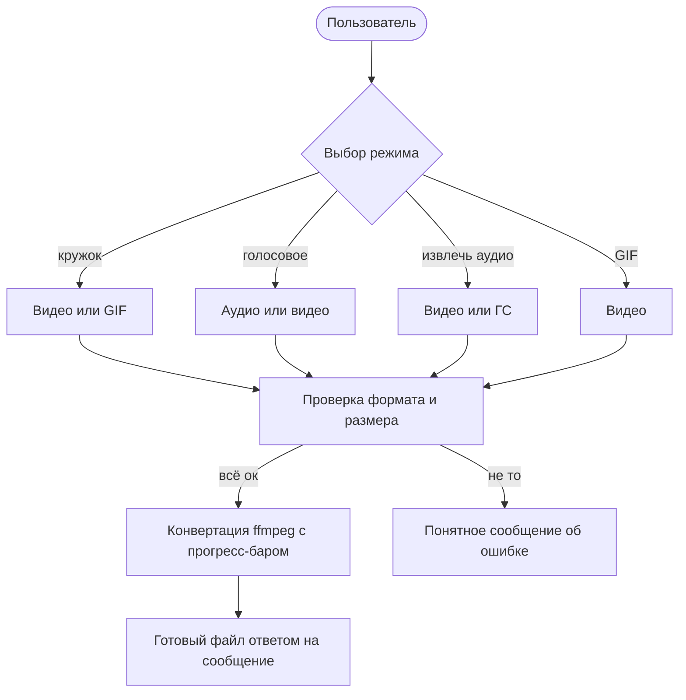

<div align="center">

# 🎬 Аудио/видео инструмент

**Telegram-бот для конвертации медиа: видеокружки, голосовые, извлечение звука и GIF**


</div>

---

## Оглавление

0. [О проекте](#о-проекте)
1. [Что умеет бот](#что-умеет-бот)
2. [Как это работает](#как-это-работает)
3. [Работа в группах](#работа-в-группах)
4. [Поддерживаемые форматы](#поддерживаемые-форматы)
5. [Две версии: лайт и полная](#две-версии-лайт-и-полная)
6. [Возможности версии 1 (лайт)](#возможности-версии-1-лайт)
7. [Возможности версии 2 (полная)](#возможности-версии-2-полная)
8. [Скриншоты](#скриншоты)
9. [Установка и запуск](#установка-и-запуск)
10. [Используемые технологии](#используемые-технологии)
11. [Структура проекта](#структура-проекта)
12. [Благодарности](#благодарности)
13. [Лицензия](#лицензия)
3. [Поддерживаемые форматы](#поддерживаемые-форматы)
4. [Две версии: лайт и полная](#две-версии-лайт-и-полная)
5. [Возможности версии 1 (лайт)](#возможности-версии-1-лайт)
6. [Возможности версии 2 (полная)](#возможности-версии-2-полная)
7. [Скриншоты](#скриншоты)
8. [Установка и запуск](#установка-и-запуск)
9. [Используемые технологии](#используемые-технологии)
10. [Структура проекта](#структура-проекта)
11. [Благодарности](#благодарности)
12. [Лицензия](#лицензия)

---

## О проекте

Этот бот превращает присланные видео и аудио в удобные форматы Telegram. Выбираете режим, отправляете файл — и получаете результат **ответом на ваше сообщение**, с живым прогресс-баром во время конвертации.

Бот умеет работать с «тяжёлыми» файлами (например, видео с iPhone в HDR / Dolby Vision), аккуратно встаёт в очередь при нескольких файлах и не зависает на проблемных роликах.

[⬆️ К оглавлению](#оглавление)

---

## Что умеет бот

| Режим | Что делает | Что принимает на вход |
| --- | --- | --- |
| 🎬 **Видеокружок** | Делает круглое видео-сообщение (video note) | видео или GIF |
| 🎵 **В голосовое** | Превращает звук в голосовое сообщение | аудио или видео |
| 🎶 **Извлечь аудио** | Достаёт звук в виде mp3 | видео или голосовое |
| 🖼️ **В GIF** | Собирает GIF из видео | видео |

[⬆️ К оглавлению](#оглавление)

---

## Как это работает



> 💡 Режим «прилипает»: выбрали один раз — и можно отправлять файлы один за другим, не нажимая кнопку каждый раз.

[⬆️ К оглавлению](#оглавление)

---

## Работа в группах

Бот работает не только в личке, но и в группах — причём **в обеих версиях одинаково**.

В группе всё управление идёт **командами** (кнопок-меню там нет):

| Команда | Что делает |
| --- | --- |
| `/start` | Начать работу бота и вывести список команд |
| `/cancel` | Отменить текущую конвертацию |
| `/videonote` | Видеокружок (строго по центру) |
| `/tovoice` | В голосовое |
| `/extractaudio` | Извлечь аудио |
| `/togif` | В GIF (первые 30 секунд) |

Отправьте нужную команду, затем пришлите файл **ответом (reply) на сообщение бота** — иначе из-за настроек приватности Telegram он его не получит. В группах конвертация всегда в простом виде: кружок — по центру, GIF — первые 30 секунд (без пошагового выбора кадра и отрезка).

[⬆️ К оглавлению](#оглавление)

---

## Поддерживаемые форматы

**🎥 Видео на входе**

| Как прислать | Форматы |
| --- | --- |
| Видео или документ | mp4, mkv, mov, avi, webm, flv, wmv, m4v, mpg, mpeg, 3gp, ts, m2ts, ogv |
| Дополнительно | видеосообщение («кружок»), GIF / анимация |

**🎧 Аудио на входе**

| Как прислать | Форматы |
| --- | --- |
| Аудио или документ | mp3, wav, flac, aac, ogg, oga, opus, m4a, wma, aiff, aif, alac, ape, wv |
| Дополнительно | голосовое сообщение |

**📤 Что получается на выходе**

| Режим | Формат результата |
| --- | --- |
| Видеокружок | mp4, 512×512 |
| Голосовое | ogg (opus) |
| Извлечение аудио | mp3, 192 kbps |
| GIF | gif, 15 fps, ширина 320 px |

**⏱️ Ограничения**

| Параметр | Значение |
| --- | --- |
| Размер файла | до 20 МБ (лимит Telegram на скачивание ботом) |
| Длительность кружка | до 60 секунд (длиннее — обрежется) |
| Длительность аудио | до 5 минут |
| Длительность GIF | первые 30 секунд |

[⬆️ К оглавлению](#оглавление)

---

## Две версии: лайт и полная

Проект существует в двух вариантах — они живут в разных ветках репозитория.

| Возможность | Версия 1 (лайт) · ветка `v1` | Версия 2 (полная) · ветка `main` |
| --- | :---: | :---: |
| Кружок, голосовое, извлечение аудио, GIF | ✅ | ✅ |
| Интерфейс | 4 кнопки | меню с категориями + «Назад» |
| Прогресс-бар и оценка времени | ✅ | ✅ |
| Кнопка «Отмена» | ✅ | ✅ |
| Остановка при блокировке бота | ✅ | ✅ |
| Ответ (reply) на файл — и результат, и ошибки | ✅ | ✅ |
| Очередь и параллельные задачи | ✅ | ✅ |
| Устойчивость к HDR / Dolby Vision видео | ✅ | ✅ |
| Выбор области кадра для кружка | ❌ | ✅ |
| Выбор временного отрезка для GIF | ❌ (первые 30 сек) | ✅ (любой отрезок) |
| Работа в группах (по командам) | ✅ | ✅ |

> 🧩 **Лайт** проще и легче — удобна, если нужен минимум. **Полная** даёт больше контроля над результатом.

[⬆️ К оглавлению](#оглавление)

---

## Возможности версии 1 (лайт)

- [x] Четыре режима: видеокружок, голосовое, извлечение аудио, GIF
- [x] Четыре кнопки, одно простое меню
- [x] «Прилипающий» режим — файлы можно слать подряд
- [x] Очередь по пользователю + общий лимит одновременных конвертаций
- [x] Живой прогресс-бар с процентами и оценкой оставшегося времени (ETA)
- [x] Кнопка «Отмена» — обрывает текущую конвертацию
- [x] Полная остановка всех задач пользователя при блокировке бота
- [x] Ответ (reply) на исходный файл — и готовым результатом, и ошибкой
- [x] Понятные сообщения: «уже кружок / голосовое / аудиофайл / GIF», «нет звука», «неподходящий формат», «файл слишком большой»
- [x] Работа в группах: файл присылается ответом на сообщение бота
- [x] Кружок 512×512 с обрезкой по центру; видео длиннее минуты обрезается
- [x] GIF из первых 30 секунд (15 fps, ширина 320)
- [x] Декодирование видео в один поток — без падений по памяти на тяжёлых HDR/Dolby Vision файлах
- [x] Таймаут на конвертацию — бот не зависает на проблемном файле
- [x] Токен только из `.env` или переменной окружения (в коде его нет)

[⬆️ К оглавлению](#оглавление)

---

## Возможности [версии 2](https://github.com/Plushk1n/Audio-video-instrument-bot-for-Telegram/tree/main) (полная)

Всё из лайт-версии, **плюс**:

- [x] Меню с категориями (**Видео** / **Аудио**) и кнопкой «Назад» для навигации
- [x] Кнопка «Назад» сбрасывает выбранный режим
- [x] Выбор области кадра для кружка: верх / центр / низ (для вертикальных видео) или лево / центр / право (для горизонтальных) — с учётом ориентации
- [x] Выбор временного отрезка для GIF: формат `0:05-0:25` или `5-25`, кнопка «Всё», а также задание отрезка прямо в подписи к видео
- [x] GIF по одному файлу за раз с корректной обработкой альбомов (нескольких файлов сразу)

[⬆️ К оглавлению](#оглавление)

---

## Скриншоты
 - **Версия 1**:

| Главное меню | После выбора режима кружка |
|:------------:|:--------------------------:|
|  |  |

|После выбора режима GIF | После выбора режима ГС |
|:----------------------:|:----------------------:|
|  |  |

| После выбора режима извлечения аудио (также как в режиме ГС) | После нажатия на кнопку отмены |
|:------------------------------------------------------------:|:------------------------------:|
|  |   |

<br>

 - **Версия 2**:

| Главное меню |
|:------------:|
| |

| После выбора категории "Видео" |
|:------------------------------:|
|  |

| После выбора режима кружка |
|:--------------------------:|
|  |

| После выбора ракурса (Центр) | Сообщение после выбора режима GIF |
|:----------------------------:|:-----------------------:|
|  | 

| После выбора режима GIF |
|:-----------------------:|
|  |

| После выбора категории "Аудио" |
|:------------------------------:|
|  |

| Сообщение после выбора режима ГС | Сообщение после выбора режима извлечения аудио |
|:--------------------------------:|:----------------------------------------------:|
|  |  |

[⬆️ К оглавлению](#оглавление)

---

## Установка и запуск

### 1. Получите токен бота

Создайте бота у [@BotFather](https://t.me/BotFather) и скопируйте токен.

### 2. Клонируйте репозиторий

```bash
git clone https://github.com/Plushk1n/Audio-video-instrument-bot-for-Telegram.git
cd Audio-video-instrument-bot-for-Telegram
```

> 🌿 По умолчанию это ветка `main` — **полная версия 2.x**.
> Для **лайт-версии** переключитесь на ветку `v1`:
> ```bash
> git switch v1
> ```

### 3. Укажите токен в файле `.env`

Создайте файл `.env` в корне проекта:

```env
BOT_TOKEN=сюда_ваш_токен_от_BotFather
```

### 4. Запуск через Docker (рекомендуется)

В образе уже ставится ffmpeg, так что отдельно ничего настраивать не нужно.

```bash
docker build -t media-bot .
docker run -d --name media-bot --restart unless-stopped media-bot
```

> 🐳 Боту достаточно контейнера с ~1 ГБ оперативной памяти.

### 5. Запуск без Docker

Понадобится **Python 3.11+** и установленный в системе **ffmpeg**.

```bash
pip install -r requirements.txt
python src/main.py
```

[⬆️ К оглавлению](#оглавление)

---

## Используемые технологии

- 🐍 **Python 3.11**
- 🤖 **python-telegram-bot 22.x** — работа с Telegram Bot API
- 🎞️ **ffmpeg** (через **ffmpeg-python**) — вся конвертация медиа
- 🔑 **python-dotenv** — загрузка токена из `.env`
- 🐳 **Docker** — упаковка и запуск

[⬆️ К оглавлению](#оглавление)

---

## Структура проекта

```text
.
├── src/
│   └── main.py          # весь код бота
├── requirements.txt     # зависимости Python
├── Dockerfile           # образ с ffmpeg
├── .env                 # токен бота (создаёте сами; добавьте в .gitignore)
└── README.md
```

[⬆️ К оглавлению](#оглавление)

---

## Благодарности

Бот разработан с помощью **[Claude Opus 4.8 Max](https://www.anthropic.com/claude)**.
Вечный респект 🤝.

[⬆️ К оглавлению](#оглавление)

---

## Лицензия

[_MIT license_](LICENSE)

[⬆️ К оглавлению](#оглавление)
